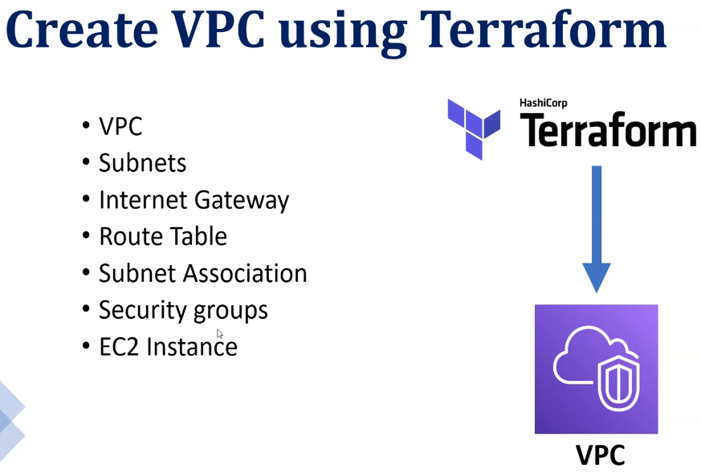
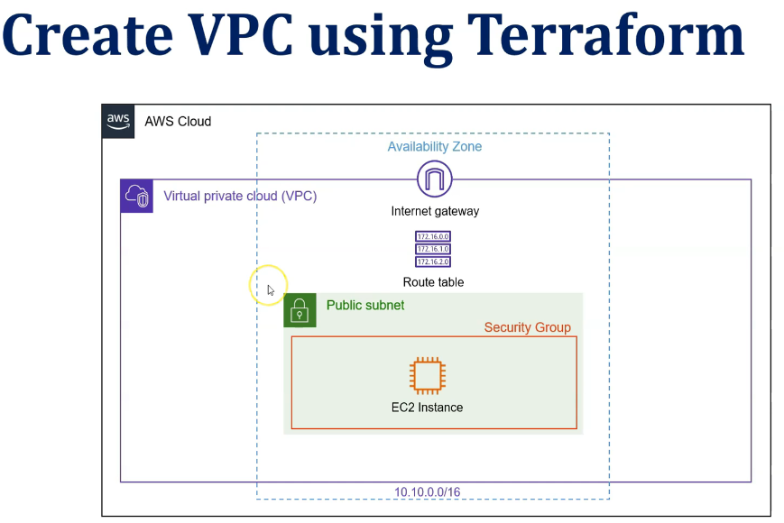

# Terraform File Structures


```sh
$ terraform init
Initializing the backend...
Initializing provider plugins...
- Finding hashicorp/aws versions matching "6.27.0"...
- Installing hashicorp/aws v6.27.0...
- Installed hashicorp/aws v6.27.0 (signed by HashiCorp)
Terraform has created a lock file .terraform.lock.hcl to record the provider
selections it made above. Include this file in your version control repository
so that Terraform can guarantee to make the same selections by default when
you run "terraform init" in the future.

Terraform has been successfully initialized!

You may now begin working with Terraform. Try running "terraform plan" to see
any changes that are required for your infrastructure. All Terraform commands
should now work.

If you ever set or change modules or backend configuration for Terraform,
rerun this command to reinitialize your working directory. If you forget, other
commands will detect it and remind you to do so if necessary.

tchat@247-Tchatua MINGW64 ~/OneDrive/Documents/11_Tchatua_Family/a12_DevOps/a05_AWS_Workshop_Lab/AWS_Three_Tier_Web_Architecture_with_Terraform/a02_Terraform_File_Structure (develop)
$ terraform fmt
a01_Provider_Block.tf
a02_Terraform_Block.tf
a03_EC2.tf

tchat@247-Tchatua MINGW64 ~/OneDrive/Documents/11_Tchatua_Family/a12_DevOps/a05_AWS_Workshop_Lab/AWS_Three_Tier_Web_Architecture_with_Terraform/a02_Terraform_File_Structure (develop)
$ terraform validate
Success! The configuration is valid.


tchat@247-Tchatua MINGW64 ~/OneDrive/Documents/11_Tchatua_Family/a12_DevOps/a05_AWS_Workshop_Lab/AWS_Three_Tier_Web_Architecture_with_Terraform/a02_Terraform_File_Structure (develop)
$ terraform plan

Terraform used the selected providers to generate the following execution plan. Resource actions are indicated with the following
symbols:
  + create

Terraform will perform the following actions:

  # aws_instance.t02_sample_server will be created
  + resource "aws_instance" "t02_sample_server" {
      + ami                                  = "ami-00e428798e77d38d9"
      + arn                                  = (known after apply)
      + associate_public_ip_address          = (known after apply)
      + availability_zone                    = (known after apply)
      + disable_api_stop                     = (known after apply)
      + disable_api_termination              = (known after apply)
      + ebs_optimized                        = (known after apply)
      + enable_primary_ipv6                  = (known after apply)
      + force_destroy                        = false
      + get_password_data                    = false
      + host_id                              = (known after apply)
      + host_resource_group_arn              = (known after apply)
      + iam_instance_profile                 = (known after apply)
      + id                                   = (known after apply)
      + instance_initiated_shutdown_behavior = (known after apply)
      + instance_lifecycle                   = (known after apply)
      + instance_state                       = (known after apply)
      + instance_type                        = "t3-micro"
      + ipv6_address_count                   = (known after apply)
      + ipv6_addresses                       = (known after apply)
      + key_name                             = "kubectl_argocd_keypair"
      + monitoring                           = (known after apply)
      + outpost_arn                          = (known after apply)
      + password_data                        = (known after apply)
      + placement_group                      = (known after apply)
      + placement_group_id                   = (known after apply)
      + placement_partition_number           = (known after apply)
      + primary_network_interface_id         = (known after apply)
      + private_dns                          = (known after apply)
      + private_ip                           = (known after apply)
      + public_dns                           = (known after apply)
      + public_ip                            = (known after apply)
      + region                               = "us-east-2"
      + secondary_private_ips                = (known after apply)
      + security_groups                      = (known after apply)
      + source_dest_check                    = true
      + spot_instance_request_id             = (known after apply)
      + subnet_id                            = (known after apply)
      + tags                                 = {
          + "Name" = "T02-EC2"
        }
      + tags_all                             = {
          + "Name" = "T02-EC2"
        }
      + tenancy                              = (known after apply)
      + user_data_base64                     = (known after apply)
      + user_data_replace_on_change          = false
      + vpc_security_group_ids               = (known after apply)

      + capacity_reservation_specification (known after apply)

      + cpu_options (known after apply)

      + ebs_block_device (known after apply)

      + enclave_options (known after apply)

      + ephemeral_block_device (known after apply)

      + instance_market_options (known after apply)

      + maintenance_options (known after apply)

      + metadata_options (known after apply)

      + network_interface (known after apply)

      + primary_network_interface (known after apply)

      + private_dns_name_options (known after apply)

      + root_block_device (known after apply)
    }

Plan: 1 to add, 0 to change, 0 to destroy.

──────────────────────────────────────────────────────────────────────────────────────────────────────────────────────────────────────

Note: You didn't use the -out option to save this plan, so Terraform can't guarantee to take exactly these actions if you run
"terraform apply" now.
```

## VPC




